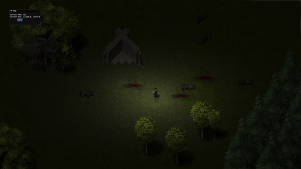

# ECS

A simple ECS-based 2D game engine created from scratch, compatible with Android, Windows, and Linux.

### Features:
- **Hybrid Sparse | Arch based ECS**:
  - Concurrent rotation logging for logs and metrics
  - Macro-based queries that fully support Rust ownership rules
  - Special testing framework with dependency injection
- **SDL2 + Glium + Imgui integration** with Android support
- Reading tile maps based on AffinityPhoto files

### Games:
- **Wolf Survivors**: Run using `cargo run --example wolf_survivors --features=pc`

### Notable Dependencies:
- **Glium**: OpenGL wrapper
- **basis-universal**: Basis texture encoding/decoding
- **imgui**: Immediate mode GUI library
- **SDL2**: Input and hardware handling

### Roadmap:
- Multi-thread scheduling
- Scripting
- Save/Loading data
- Audio mixer
- Electron UI
    

## Commands

- Build    - `cargo run --features release`
- Examples - `cargo run --example log --features release`
- Tests    - `cargo test --lib -Zpanic-abort-tests` or `cargo nextest run --lib`
- Miri     - `cargo miri nextest run -j4 --color=always --lib world`

## Testing

- `#[cfg(test)]` - compile code only for tests env
- `#[cfg(feature = "release")]`- compile code for tests and production env

## Rust-analyzer

- enable typing for testing & release code `cargo.features = ["release"]`
- use `if (true) {} else {}` to prevent borrowing issues for shared variables

## FAQ

- Integration tests freeze without error? Add `-- --nocapture` paramaters to get panics logs
